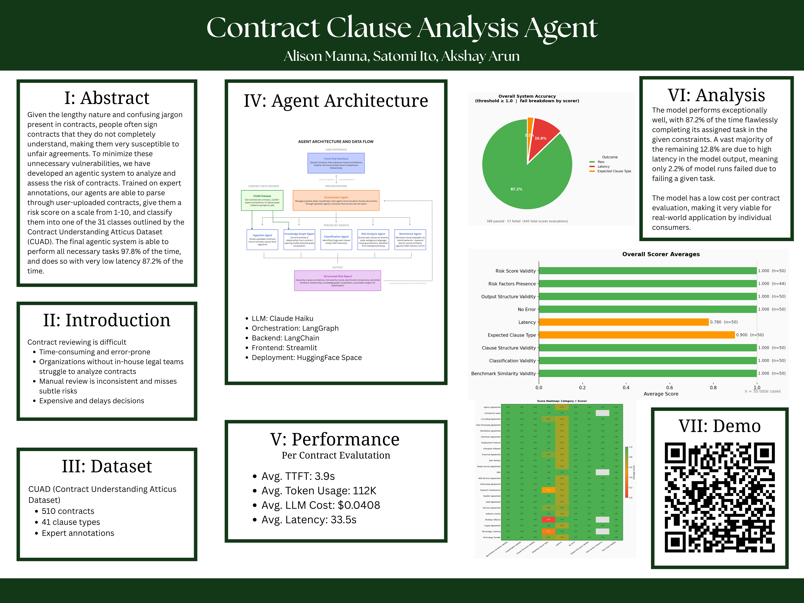

# MULTI-AGENT AI ARCHITECTURE FOR COMMERCIAL CONTRACT CLAUSE ANALYSIS

   

**Alison Manna · Akshay Arun · Satomi Ito**

---

---

## Project Documents

- [Proposal](proposal.md)
- [Check-In 1](check-in-1.md)
- [Full Report](report.pdf)

---

## Abstract

Contract review is a time-intensive and error-prone process requiring specialized legal expertise. Organizations without dedicated legal teams often lack the resources to thoroughly analyze contracts, exposing them to regulatory risk and unfavorable terms. This paper presents a multi-agent AI system that automates end-to-end commercial contract analysis, enabling faster, more consistent clause-level evaluation and risk assessment.

Our system employs a pipeline of six agents orchestrated with LangGraph: an Ingestion Agent that parses raw contract text into clause-level segments, a Knowledge Graph Agent that extracts entities and relationships, a Classification Agent that labels clauses using the 41-type CUAD taxonomy, a Risk Analysis Agent that evaluates risk factors and severity using CUAD's legal review questions as a structured rubric, and a Benchmark Agent that compares clause language to industry standards using hybrid retrieval over the CUAD corpus, combining ChromaDB semantic vector search with BM25 keyword matching to surface the most relevant real-contract examples. A central Orchestrator coordinates the pipeline and compiles results into a structured JSON risk report.

The system processes real commercial contracts drawn from the CUAD corpus, applying the multi-agent pipeline to extract and analyze clauses. The system successfully classifies clauses by type and generates detailed risk assessments with explanatory factors that align with legal concerns. The system provides actionable insights without requiring legal domain expertise, reducing friction for non-legal stakeholders to access contract intelligence.

The system is deployed as an interactive web application (Streamlit on HuggingFace Spaces), enabling users to upload contracts and receive clause-by-clause analysis in real time. By combining structured prompting with multi-agent orchestration, we demonstrate that automated contract analysis can provide interpretable, reliable results suitable for supporting human decision-making in contract negotiation.

## Overview

The system implements a multi-agent pipeline for automated commercial contract clause analysis, orchestrated using LangGraph. The architecture follows a cluster pattern in which a central Orchestrator Agent receives contract documents, dispatches them through agents, and compiles their outputs into a unified risk report. Figure 1 presents the proposed agent architecture and data flow.

## Agent Descriptions

The system comprises one central Orchestrator and five specialist agents:

**Orchestrator Agent.** Serves as a central hub of the system, coordinating the full contract analysis pipeline through LangGraph's StateGraph. The Orchestrator manages pipeline state and routes documents sequentially through the specialist agents. The report node aggregates clause-level results and produces a JSON summary containing clause annotations, risk scores, risk factors, benchmark similarity scores, extracted entities and relationships, a knowledge graph visualization path, and source text excerpts.

**Ingestion Agent.** Serves as the parsing layer of the pipeline. It accepts raw contract text from the Orchestrator and segments it into clause-level units using regex-based pattern matching to identify structural markers such as section headers, exhibit labels, and numbered subsections. When structural markers are absent, the agent falls back to paragraph-level segmentation using double-newline delimiters. Each clause is assigned a unique identifier and tagged with its originating section label. This segmentation enables clause-level analysis and manages token budgets when interfacing with the language model in subsequent stages.

**Knowledge Graph Agent.** Extracts key entities and relationships from the contract opening section. The agent uses Claude Haiku to identify important entities (parties, dates, amounts, products, locations) and the relationships between them. It builds a directed NetworkX graph and generates a visualization showing the contract's entity relationships with color-coded node types. This provides a high-level visual summary of contract participants, obligations, and key constraints.

**Classification Agent.** Labels clauses according to the CUAD taxonomy, spanning 41 provision types such as Governing Law, Non-Compete, Indemnification, and IP Ownership Assignment. The agent uses clear prompting with Anthropic's Claude Haiku model, returning structured JSON with the predicted clause type, a confidence score on a 0 to 1 scale, and a natural language reasoning trace for explainability. On JSON parsing failure, the agent defaults to an "Other" classification rather than halting the pipeline.

**Risk Analysis Agent.** Evaluates each classified clause on a severity scale using the CUAD's taxonomy annotations as a structured rubric. For each clause type, the agent injects the corresponding CUAD legal review questions into the prompt, guiding the language model to assess ambiguous or vague language, missing protective provisions standard for that clause type, and deviation from standard phrasing. The agent uses zero-shot prompting with Anthropic's Claude Haiku model, returning structured JSON containing a risk score (0 to 1 scale), an itemized list of specific risk factors, and a natural-language reasoning trace.

**Benchmark Agent.** Contextualizes each clause by comparing it to industry standard language for its classified type, using a hybrid retrieval strategy over the CUAD corpus. For each clause, the agent runs two parallel retrieval methods: ChromaDB vector search using sentence-transformer embeddings (all-MiniLM-L6-v2) to find semantically similar clauses, and BM25 keyword matching via BM25Okapi to find clauses with closely matching terminology. Results from both methods are deduplicated and formatted as labeled examples, distinguishing semantic matches from keyword matches, which are then injected into the LLM prompt as grounded context. The agent uses Anthropic's Claude Haiku model to evaluate how closely the input clause aligns with the retrieved CUAD examples, returning structured JSON containing a similarity score on a 0 to 1 scale (0 = unusual, 1 = standard), a list of deviations from standard language, and a summary of what is typical for that clause type. This hybrid approach grounds benchmark assessments in real contract language rather than relying solely on the model's training knowledge, reducing the risk of speculative comparisons for specialized or niche clause types.