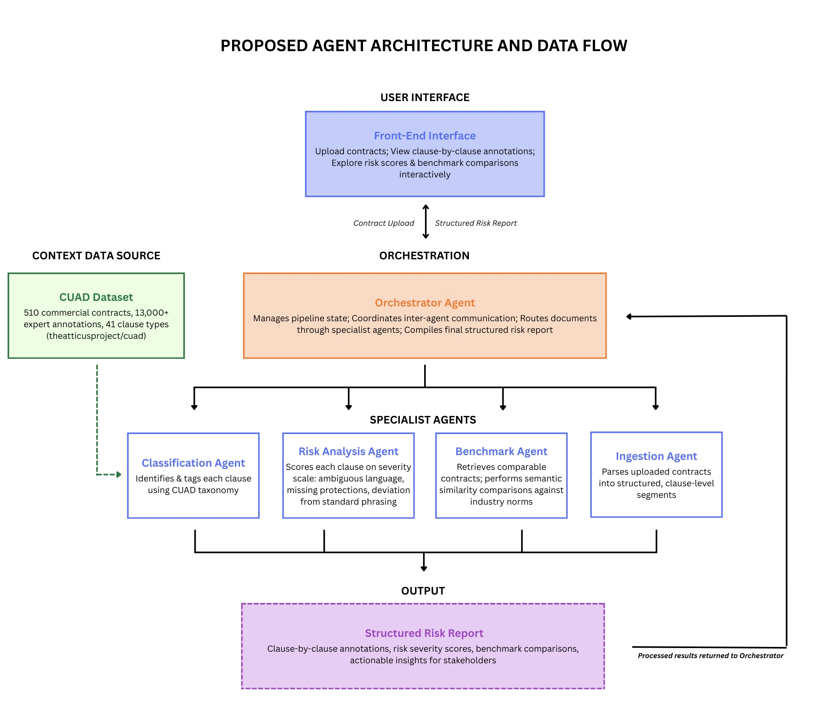

# Milestone 2: First Check In

### Updated Model Architecture

**Modifications**:
* Removed unnecessary SEC EDGAR dataset 
* Pivoted utilization of CUAD dataset from Agentic training to context engineering for Classification Agent

### Risks/Mitigation Plan

| Risk | Mitigation|
|------|-----------|
|Token Rate Limits | Utlizing Claude API credits for optimized token usage to credit cost tradeoff|
|Token Size Limits| Ingestion Agent parses contract into clause-level segments|
|Agent Innacuracies| Orchestrator Agent will evaluate the consistency of the outputs of the agents |
|Specialist Agent Errors| Error retry loop for each agent|
