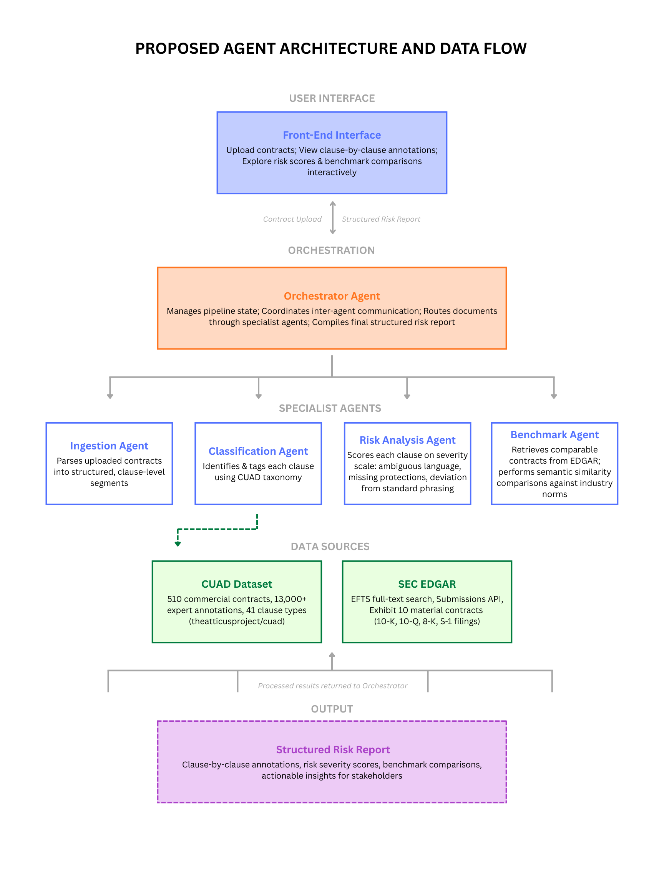

<h1 style="text-align: center;">MULTI-AGENT AI ARCHITECTURE FOR COMMERCIAL CONTRACT CLAUSE ANALYSIS</h1>

#### 1.0 Abstract
Contract review is a time-intensive and error-prone process that requires specialized legal expertise to identify risk, ensure compliance, and benchmark clause language against industry standards. A lot of organizations often lack dedicated legal departments, leaving them vulnerable to regulatory exposure and unfavorable terms in important documents like NDAs, master service agreements, statements of work, vendor agreements, and employment contracts. This project proposes an AI-powered multi-agent system that automates the end-to-end contract review pipeline: parsing raw contract documents, classifying individual clauses, scoring risk levels, and comparing clause language against publicly available benchmark contracts.

The system employs a multi-agent architecture orchestrated by LangGraph. An Ingestion Agent parses uploaded contracts into structured, clause-level segments. A Classification Agent then identifies and tags each clause using a taxonomy derived from common contract types. A Risk Analysis Agent scores each clause on a severity scale by evaluating factors such as ambiguous language, missing protective provisions, and deviation from standard phrasing. Finally a Benchmark Agent retrieves comparable contracts from the SEC EDGAR database and performs semantic similarity comparisons, revealing how a given cause stacks up against industry norms. 

The orchestrator agent manages state, coordinates communication between agents, and compiles the final structured risk report for the user. The front-end interface will enable users to upload contracts, view clause-by-clause annotations, and explore risk scores and benchmark comparisons interactively. By combining retrieval augmented generation with specialized agent roles, this project aims to enable greater access to contract intelligence in order to provide organizations and non-legal stakeholders with actionable, explainable insights in a structured risk summary. 

#### 2.0 Data & Sources

**2.1 SEC EDGAR Full-Text Search System (EFTS)**[^1] 
Public repository of EDGAR filings to the U.S. Securities and Exchange Commission since 2001 with attached exhibit contracts (with exhibit text). Used to locate filings containing material contracts to be used as a primary benchmark corpus for industry standard clause baselines and semantic similarity scoring. 

**2.2 Contract Understanding Atticus Dataset (CUAD)**[^2] 
A dataset of 510 commercial contracts with 13,000+ expert annotations across 41 clause types, created by The Atticus Project. Provides a taxonomy to be used by the Classification Agent to segment contract clauses. Hugging Face: theatticusproject/cuad 

**2.3 SEC EDGAR Submissions API**[^3] 
RESTful API providing filing history, metadata, and exhibit listings for selected filings.

**2.4 Exhibit 10 (Material Contracts) filings**[^4] 
Contracts filed as exhibits to 10-K, 10-Q, 8-K, and S-1 forms under Regulation S-K Item 601(b)(10). This is our primary source of real commercial contract text (NDAs, licensing agreements, service agreements, etc.)

[^1]: U.S. Securities and Exchange Commission. EDGAR Full-Text Search. https://efts.sec.gov/LATEST/search-index
[^2]:  Hendrycks, D., Burns, C., Chen, A., & Ball, S. (2021). CUAD: An Expert-Annotated NLP Dataset for Legal Contract Review. Proceedings of the Neural Information Processing Systems Track on Datasets and Benchmarks (NeurIPS). arXiv:2103.06268
[^3]: U.S. Securities and Exchange Commission. EDGAR Application Programming Interfaces. https://www.sec.gov/search-filings/edgar-application-programming-interfaces
[^4]: 17 CFR § 229.601(b)(10). https://www.law.cornell.edu/cfr/text/17/229.601

#### 3.0 Proposed Agent Architecture 

