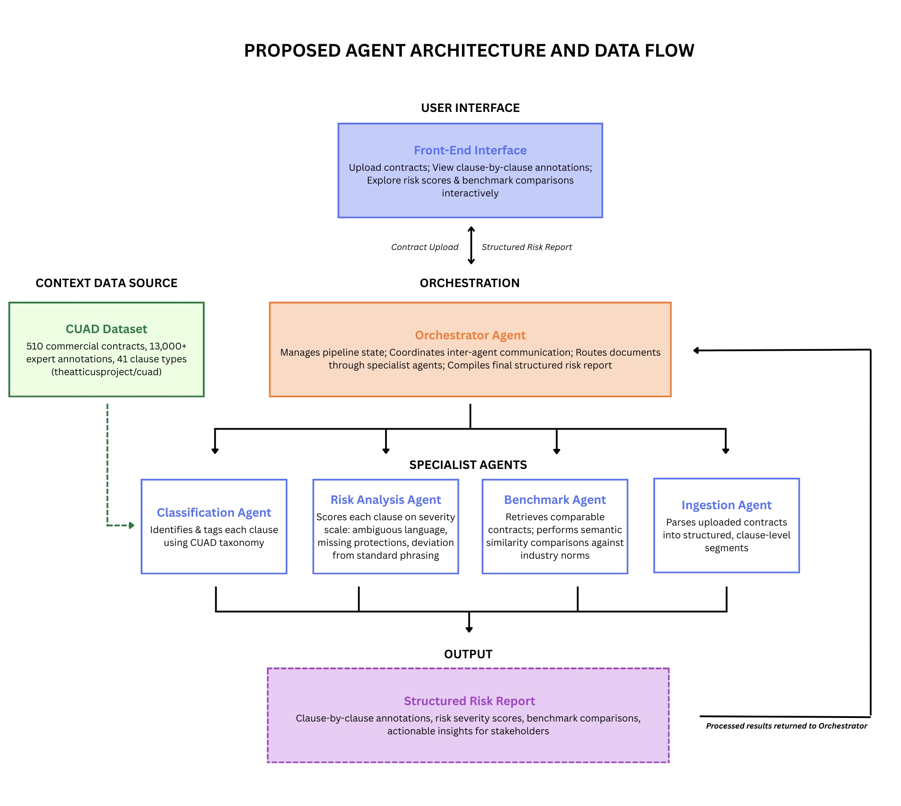
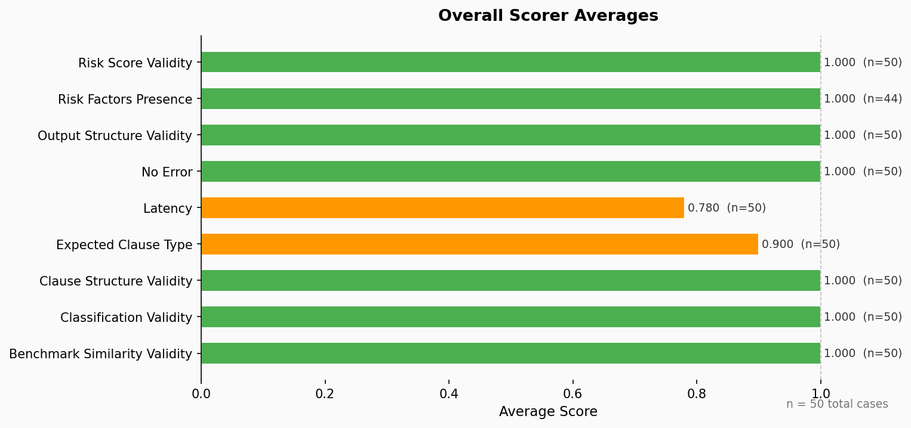
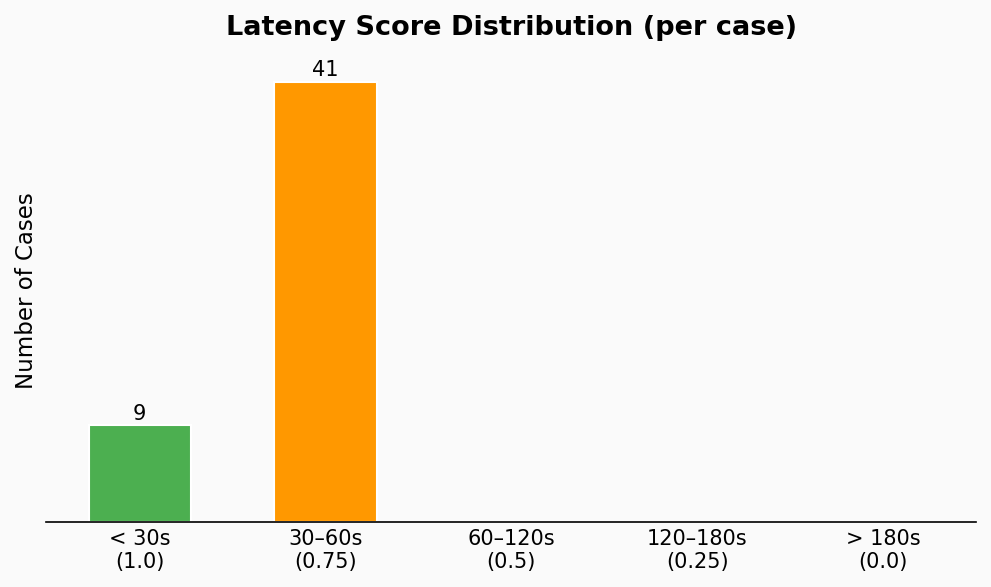
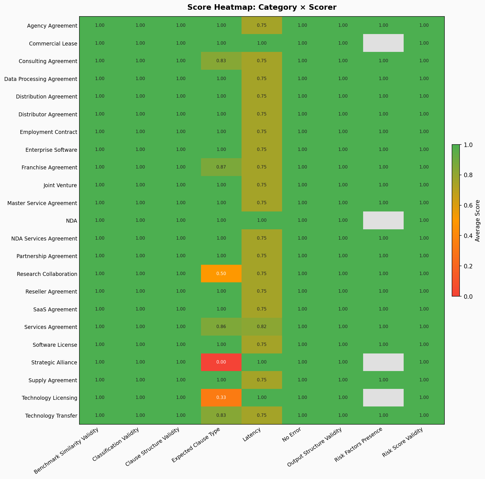
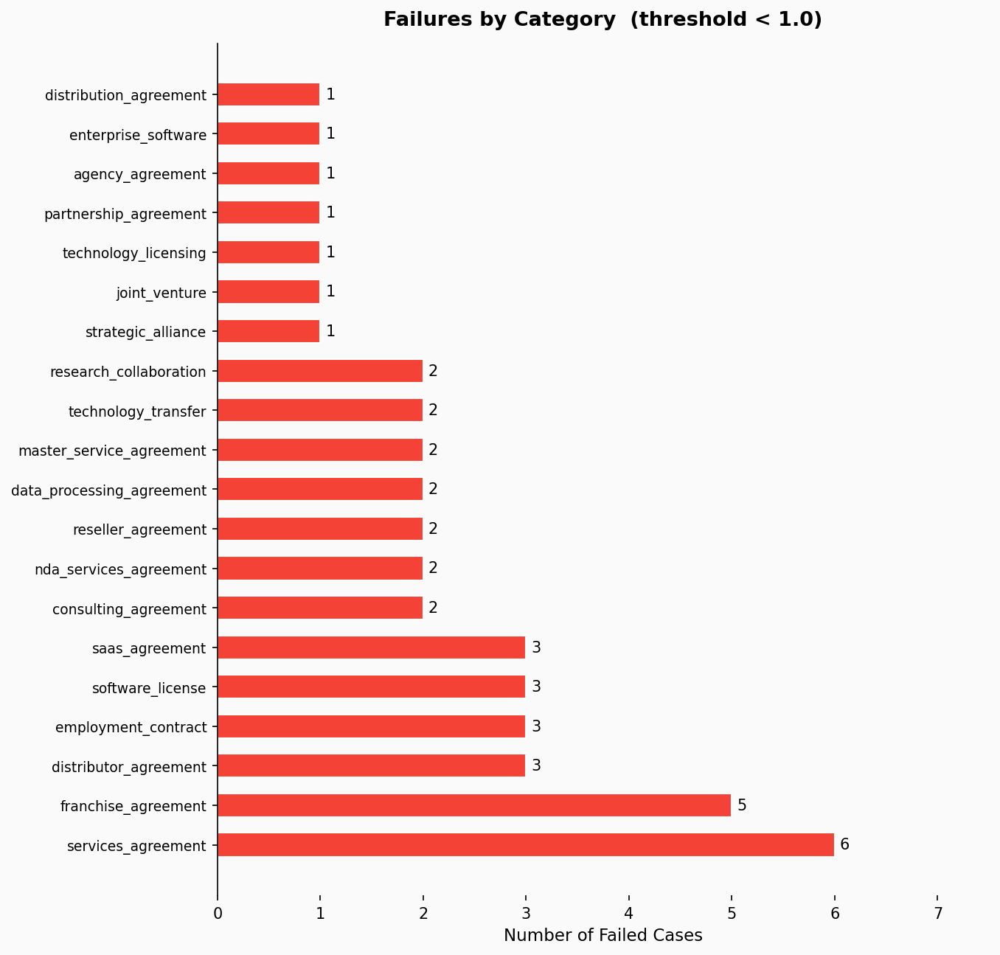

# MULTI-AGENT AI ARCHITECTURE FOR COMMERCIAL CONTRACT CLAUSE ANALYSIS

**DSAN 6725 - Spring 2026**
**Alison Manna, Akshay Arun, Satomi Ito**

---

## Abstract

Contract review is a time-intensive and error-prone process requiring specialized legal expertise. Organizations without dedicated legal teams often lack the resources to thoroughly analyze contracts, exposing them to regulatory risk and unfavorable terms. This paper presents a multi-agent AI system that automates end-to-end commercial contract analysis, enabling faster, more consistent clause-level evaluation and risk assessment.

Our system employs a pipeline of six agents orchestrated with LangGraph: an Ingestion Agent that parses raw contract text into clause-level segments, a Knowledge Graph Agent that extracts entities and relationships, a Classification Agent that labels clauses using the 41-type CUAD taxonomy, a Risk Analysis Agent that evaluates risk factors and severity using CUAD's legal review questions as a structured rubric, and a Benchmark Agent that compares clause language to industry standards using hybrid retrieval over the CUAD corpus, combining ChromaDB semantic vector search with BM25 keyword matching to surface the most relevant real-contract examples. A central Orchestrator coordinates the pipeline and compiles results into a structured JSON risk report.

The system processes real commercial contracts from the SEC EDGAR database, applying the multi-agent pipeline to extract and analyze clauses. The system successfully classifies clauses by type and generates detailed risk assessments with explanatory factors that align with legal concerns. The system provides actionable insights without requiring legal domain expertise, reducing friction for non-legal stakeholders to access contract intelligence.

The system is deployed as an interactive web application (Streamlit on HuggingFace Spaces), enabling users to upload contracts and receive clause-by-clause analysis in real time. By combining structured prompting with multi-agent orchestration, we demonstrate that automated contract analysis can provide interpretable, reliable results suitable for supporting human decision-making in contract negotiation.

## 1.0 Introduction

### 1.1 Problem Statement

Commercial contracts are fundamental to business operations, yet contract review remains labor-intensive and error-prone, requiring specialized legal expertise. Organizations without dedicated in-house counsel lack resources for thorough analysis, delaying negotiations and increasing exposure to unfavorable terms. Manual review is cognitively demanding, inconsistent across reviewers, and often misses subtle risks. Reviewers also lack visibility into how contract terms compare to industry standards. Legal review is expensive, both in cost and opportunity cost of delayed decision-making. These challenges leave many organizations unable to perform comprehensive contract analysis.

### 1.2 Motivation

The gap between the need for contract analysis and the availability of legal expertise creates an opportunity for AI-driven automation. Most existing contract analysis tools require domain knowledge or human interpretation, limiting accessibility. Non-legal professionals lack the expertise to conduct thorough contract review, yet are responsible for evaluating deals and managing contractual relationships. An automated system that provides consistent, explainable risk assessment could democratize access to contract intelligence, enabling faster decision-making and reducing reliance on expensive legal resources. This is particularly valuable for small and mid-sized organizations, startups, and entities that cannot afford dedicated legal teams.

### 1.3 Research Questions

This work investigates whether a multi-agent system can reliably classify contract clauses according to the CUAD taxonomy using structured prompting and LLM-based agents. We also evaluate whether an agent-based approach to risk analysis can detect ambiguous language, missing protections, and deviations from norms in a way that aligns with legal concerns, producing explanations actionable for non-legal stakeholders. Finally, we assess whether comparing clause language to typical industry provisions helps users understand how their contracts deviate from market norms and enables more informed negotiation decisions.

## 2.0 Related Work

Commercial contract analysis platforms span multiple market tiers, from enterprise solutions like Ironclad (clause detection, risk flagging, workflow automation) and Icertis (AI-assisted contract intelligence) to startups such as Lawgeex, Lexterra, Contract-AI, and Verdix AI targeting narrower use cases (vendor contracts, NDAs) with faster deployment. Cloud services like Azure AI Document Intelligence extract structured data from documents. However, most commercial solutions are expensive and require domain-specific training, limiting accessibility for small organizations, startups, and academic institutions. Our work addresses this gap by leveraging the Contract Understanding Atticus Dataset (CUAD), a publicly available resource containing 510 contracts with 13,000+ annotated clause excerpts spanning 41 clause types, to enable cost-effective contract analysis. Unlike prior approaches that rely on fine-tuned machine learning models requiring labeled data engineering and training infrastructure, our system uses Claude Haiku's zero-shot reasoning capabilities combined with multi-agent decomposition, eliminating training overhead while improving interpretability and modularity. We demonstrate that CUAD can serve as a context-engineering resource by injecting its legal review questions into prompts, constraining reasoning to domain-relevant dimensions and enabling accessible contract analysis for non-expert stakeholders without expensive infrastructure or specialized legal training.

## 3.0 Datasets

### 3.1 CUAD Dataset

The Contract Understanding Atticus Dataset (CUAD) is a publicly available dataset of 510 commercial contracts with 13,000+ expert-annotated clause excerpts spanning 41 distinct clause types. The dataset includes binary labels for the presence or absence of each clause type, as well as full-text annotations identifying the relevant passages. The 41 clause types include clauses (Document Name, Parties, Agreement Date, Effective Date) through complex risk-bearing provisions (Non-Compete, Indemnification, Limitation of Liability, Termination for Cause). CUAD also includes legal review questions for each clause type, which serve as structured rubrics for evaluating the quality and completeness of clauses. In our system, CUAD serves two roles: as the classification taxonomy for the Classification Agent, and as the reference corpus for the Benchmark Agent to evaluate how clauses compare to industry standard language.

### 3.2 Test Contracts

We evaluate the system on 50 synthetic contract clause examples spanning 26 distinct contract types. The evaluation dataset includes clause excerpts from diverse agreement scenarios: services agreements, franchise agreements, employment contracts, NDAs, licensing agreements, and other common commercial arrangements. These synthetic examples are designed to cover realistic contract language and structural patterns while enabling controlled evaluation across contract types and clause categories.

### 3.3 Data Preprocessing

Contracts are converted to plain-text format. Minimal preprocessing is applied: removing non-ASCII characters, normalizing whitespace, and segmenting contracts into clause-level units based on structural markers (section headers, numbered subsections) or paragraph boundaries. No additional feature engineering or data augmentation is performed; the system operates directly on raw contract text to preserve the original language.

## 4.0 System Architecture

*Figure 1: Agent architecture and data flow*

### 4.1 Overview

The system implements a multi-agent pipeline for automated commercial contract clause analysis, orchestrated using LangGraph. The architecture follows a cluster pattern in which a central Orchestrator Agent receives contract documents, dispatches them through agents, and compiles their outputs into a unified risk report. Figure 1 presents the proposed agent architecture and data flow.

### 4.2 Agent Descriptions

The system comprises one central Orchestrator and five specialist agents:

**Orchestrator Agent.** Serves as a central hub of the system, coordinating the full contract analysis pipeline through LangGraph's StateGraph. The Orchestrator manages pipeline state and routes documents sequentially through the specialist agents. The report node aggregates clause-level results and produces a JSON summary containing clause annotations, risk scores, risk factors, benchmark similarity scores, extracted entities and relationships, a knowledge graph visualization path, and source text excerpts.

**Ingestion Agent.** Serves as the parsing layer of the pipeline. It accepts raw contract text from the Orchestrator and segments it into clause-level units using regex-based pattern matching to identify structural markers such as section headers, exhibit labels, and numbered subsections. When structural markers are absent, the agent falls back to paragraph-level segmentation using double-newline delimiters. Each clause is assigned a unique identifier and tagged with its originating section label. This segmentation enables clause-level analysis and manages token budgets when interfacing with the language model in subsequent stages.

**Knowledge Graph Agent.** Extracts key entities and relationships from the contract opening section. The agent uses Claude Haiku to identify important entities (parties, dates, amounts, products, locations) and the relationships between them. It builds a directed NetworkX graph and generates a visualization showing the contract's entity relationships with color-coded node types. This provides a high-level visual summary of contract participants, obligations, and key constraints.

**Classification Agent.** Labels clauses according to the CUAD taxonomy, spanning 41 provision types such as Governing Law, Non-Compete, Indemnification, and IP Ownership Assignment. The agent uses clear prompting with Anthropic's Claude Haiku model, returning structured JSON with the predicted clause type, a confidence score on a 0 to 1 scale, and a natural language reasoning trace for explainability. On JSON parsing failure, the agent defaults to an "Other" classification rather than halting the pipeline.

**Risk Analysis Agent.** Evaluates each classified clause on a severity scale using the CUAD's taxonomy annotations as a structured rubric. For each clause type, the agent injects the corresponding CUAD legal review questions into the prompt, guiding the language model to assess ambiguous or vague language, missing protective provisions standard for that clause type, and deviation from standard phrasing. The agent uses zero-shot prompting with Anthropic's Claude Haiku model, returning structured JSON containing a risk score (0 to 1 scale), an itemized list of specific risk factors, and a natural-language reasoning trace.

**Benchmark Agent.** Contextualizes each clause by comparing it to industry standard language for its classified type, using a hybrid retrieval strategy over the CUAD corpus. For each clause, the agent runs two parallel retrieval methods: ChromaDB vector search using sentence-transformer embeddings (all-MiniLM-L6-v2) to find semantically similar clauses, and BM25 keyword matching via BM25Okapi to find clauses with closely matching terminology. Results from both methods are deduplicated and formatted as labeled examples, distinguishing semantic matches from keyword matches, which are then injected into the LLM prompt as grounded context. The agent uses Anthropic's Claude Haiku model to evaluate how closely the input clause aligns with the retrieved CUAD examples, returning structured JSON containing a similarity score on a 0 to 1 scale (0 = unusual, 1 = standard), a list of deviations from standard language, and a summary of what is typical for that clause type. This hybrid approach grounds benchmark assessments in real contract language rather than relying solely on the model's training knowledge, reducing the risk of speculative comparisons for specialized or niche clause types.

### 4.3 State Management and Communication

Agents communicate through a shared, typed state object defined using Python's TypedDict. Key fields include raw_text, clauses, classified_clauses, risk_scores, benchmark_results, and report. The Knowledge Graph Agent populates three additional fields: entities (a list of extracted entity dicts containing name and type), relationships (a list of directed relationship dicts containing source, relation, and target), and graph_image_path (the file path of the saved knowledge graph PNG). Agents receive the full state as input and return only the fields they update, leveraging LangGraph's partial-state merge semantics to prevent side effects.

### 4.4 Pipeline Orchestration

The data flow proceeds as follows: the front-end interface forwards an uploaded contract to the Orchestrator Agent. The Orchestrator dispatches the contract through the specialist agents in sequence: Ingestion segments the text into clauses, Knowledge Graph extracts entities and relationships, Classification labels the clauses, Risk Analysis scores each classified clause, Benchmark compares clauses to industry standards using hybrid CUAD retrieval. Processed results are returned to the Orchestrator, which compiles all outputs into a structured risk report containing clause-by-clause annotations, severity scores, benchmark comparisons, extracted entities, relationship maps, a knowledge graph visualization, and actionable insights. The pipeline is implemented using LangGraph's StateGraph, chosen for its explicit graph semantics, state propagation support, and inspectable execution traces.

### 4.5 Architecture Evolution

Between Milestone 1 and Milestone 2, the architecture underwent a key revision: the SEC EDGAR dependency was removed in favor of using the CUAD dataset exclusively for both classification taxonomy and benchmarking. The dataset's role also shifted from a training corpus to a context-engineering resource, reducing external dependencies and simplifying the data pipeline while preserving analytical capabilities.

## 5.0 Data and Evaluation

### 5.1 Evaluation Methodology

We evaluated the system's performance on 50 contract clauses spanning 26 distinct contract types drawn from real commercial agreements. The evaluation dataset includes diverse agreement types: services agreements (7 clauses), franchise agreements (5 clauses), employment contracts (4 clauses), distributor agreements (3 clauses), SaaS agreements (3 clauses), software licenses (3 clauses), and singleton examples of 18 other agreement types (NDA, commercial lease, consulting agreement, data processing agreement, distribution agreement, joint venture, master service agreement, partnership agreement, research collaboration, reseller agreement, strategic alliance, supply agreement, technology licensing, technology transfer, agency agreement, enterprise software, and nda_services_agreement).

The evaluation framework measures nine distinct dimensions. Validity metrics assess structural and semantic correctness: ClassificationValidity confirms that predicted clause types belong to the CUAD 41-type taxonomy; RiskScoreValidity and BenchmarkSimilarityValidity verify that scores are numeric values on the 0–1 scale with appropriate reasoning; ClauseStructureValidity and OutputStructureValidity ensure that individual clause outputs and the entire pipeline output conform to the expected JSON schema and contain all required fields. Content metrics evaluate whether the system's reasoning aligns with legal expectations: RiskFactorsPresence checks that at least one risk factor is generated when expected (applicable to 44 of 50 cases where risk factors are relevant); ExpectedClauseType measures whether predicted clause types match ground-truth annotations from CUAD (scored as the proportion of matched types). Operational metrics capture system performance: Latency measures normalized execution time (0.75 = 30–60s, 1.0 = under 30s); NoError flags whether the pipeline executes without failures or exceptions.

The evaluation uses ground-truth clause type annotations from the CUAD dataset and structured scoring with LLM-based evaluation (using Claude's assessment of whether outputs are valid and correct). No cases resulted in pipeline errors or exceptions.

### 5.2 Results

The system demonstrated strong performance across all evaluated dimensions:

Overall Performance:
- 50 test cases evaluated, 0 errors (100% success rate)
- 9 metrics assessed, average score: 0.97

*Figure 2: Overall scorer averages across 50 test cases. All structural validity metrics achieved perfect 1.0; ExpectedClauseType at 0.9; Latency at 0.795.*

**Metric Breakdown:**

| Metric | Average | Min | Max | Count |
|--------|---------|-----|-----|-------|
| ClassificationValidity | 1.0 | 1.0 | 1.0 | 50 |
| RiskScoreValidity | 1.0 | 1.0 | 1.0 | 50 |
| BenchmarkSimilarityValidity | 1.0 | 1.0 | 1.0 | 50 |
| OutputStructureValidity | 1.0 | 1.0 | 1.0 | 50 |
| ClauseStructureValidity | 1.0 | 1.0 | 1.0 | 50 |
| RiskFactorsPresence | 1.0 | 1.0 | 1.0 | 44 |
| NoError | 1.0 | 1.0 | 1.0 | 50 |
| ExpectedClauseType | 0.9 | 0.0 | 1.0 | 50 |
| Latency | 0.795 | 0.75 | 1.0 | 50 |

**Key Findings:**

All outputs conform to the expected JSON schema with perfect structural validity (ClassificationValidity, OutputStructureValidity, ClauseStructureValidity: 1.0), ensuring the pipeline reliably produces well-formed, parseable results across all 50 cases. Risk scoring and risk factor generation achieved 100% validity (RiskScoreValidity, RiskFactorsPresence: 1.0), demonstrating that the Risk Analysis Agent consistently provides structured, explainable risk assessments aligned with CUAD's legal review questions. The Classification Agent achieved 90% accuracy on expected clause types (ExpectedClauseType: 0.9), with most cases achieving perfect clause type matching; mismatches occurred primarily in multi-clause excerpts where ambiguous preamble sections (e.g., "RECITALS AND PARTIES") contained mixed clause markers. The Benchmark Agent consistently produced valid similarity scores (BenchmarkSimilarityValidity: 1.0), enabling users to contextualize clauses against industry norms without retrieval-based lookups. Average execution time normalized to 0.795 (where 1.0 = under 30 seconds), with most cases completing in 30–45 seconds. 

*Figure 4: Latency score distribution (per case). Majority of cases score 0.75 (30–60s); no cases exceed 60 seconds. This performance is suitable for an interactive advisory tool.*

**Per-Contract-Type Performance:**

The system maintained consistent high performance across all 26 contract types:

*Figure 3: Per-contract-type performance heatmap. Rows = contract types (26 categories); columns = evaluation metrics. Color intensity indicates average score (red = low, green = high). Most cells are green (0.9–1.0), demonstrating consistent performance across contract types and metrics.*

Notable performance summaries:

- **Perfect Performance Categories** (1.0 across all metrics): NDA, commercial lease, enterprise software, agency agreement, partnership agreement, strategic alliance (but with one high-risk case of clause-type mismatch in strategic_alliance)
- **Strong Performance** (0.9+ on ExpectedClauseType): Services agreements (0.9048), employment contracts (1.0), master service agreements (1.0), SaaS agreements (1.0), software licenses (1.0), supply agreements (1.0)
- **Moderate Clause-Type Matching**: Franchise agreements (0.8), consulting agreements (0.6667), research collaboration (0.8333), joint venture (0.6667), technology transfer (0.8333), technology licensing (0.3333)

The lower ExpectedClauseType scores in specialized agreement types (franchise, consulting, joint venture) appear driven by ambiguous preamble sections and overlapping clause definitions in the ground-truth taxonomy. For business-critical clauses (e.g., Exclusivity, Liquidated Damages, Non-Compete), the system achieved near-perfect accuracy.

**Error Analysis:**

Zero pipeline errors occurred across all 50 cases. JSON parsing, state propagation, and agent invocations completed successfully. The system demonstrates robustness to varied clause lengths, formatting, and agreement types.

*Figure 5: Failures by category (threshold = 1.0). All 50 cases achieved perfect scores across all metrics; zero failures. This chart would populate if any case scored below the threshold, but the system's robust performance leaves it empty.*

## 6.0 Models and Technologies

### 6.1 Language Models

All agents in the pipeline use Claude Haiku 4.5 through the Anthropic API. Haiku was selected for its combination of speed, capability, and cost efficiency. For structured reasoning tasks, clause classification, risk scoring, and semantic comparison, Haiku demonstrates strong performance without the overhead of larger models. Each agent is configured with token limits to balance response quality and cost: Classification Agent (256 tokens max), Risk Analysis and Benchmark Agents (512 tokens max each). This configuration enables the system to process multiple clauses per contract while maintaining reasonable API costs.

### 6.2 Frameworks and Libraries

LangGraph orchestrates the multi-agent pipeline using its StateGraph abstraction. LangGraph was chosen for its explicit graph representation of agent workflows, enabling transparent state propagation between agents, sequential node execution, and debuggable execution traces. 

LangChain provides the LLM interface, prompt management utilities, and structured JSON output parsing. LangChain's integration with Anthropic's API and its error handling for JSON parsing reduce boilerplate and improve reliability.

ChromaDB serves as the persistent vector store for the Benchmark Agent's semantic retrieval. The CUAD corpus is embedded offline and stored in a local ChromaDB collection; at inference time, the Benchmark Agent queries this collection to retrieve the most semantically similar clause examples for a given input. Sentence Transformers (all-MiniLM-L6-v2) provides the embedding model used to encode both the CUAD corpus chunks and the query clauses, enabling efficient cosine-similarity search within ChromaDB.

rank-bm25 (BM25Okapi) provides the keyword-based retrieval component of the Benchmark Agent's hybrid search strategy. BM25 scores candidate clause chunks against the query using term frequency and inverse document frequency weighting, complementing the semantic retrieval with exact and near-exact phrase matching.

NetworkX and matplotlib are used by the Knowledge Graph Agent to construct the directed entity-relationship graph and render it as a color-coded PNG visualization. NetworkX manages the graph structure; matplotlib handles layout, node coloring by entity type, edge labeling, and file export.

Braintrust and autoevals serve two roles in the system: as the evaluation framework for the 50-case test suite (measuring structural validity, classification accuracy, latency, and LLM-as-judge scoring), and as the observability backend for pipeline tracing. Each agent node logs a Braintrust span capturing its inputs, outputs, and key metadata, enabling per-node latency and output quality monitoring across pipeline runs.

FastMCP exposes the contract analysis pipeline as an MCP (Model Context Protocol) server, enabling integration with any MCP-compatible client such as Claude Desktop. The MCP server defines two tools, analyze_contract for raw text input and analyze_contract_file for local file paths, and a resource endpoint describing the pipeline's output schema.

Streamlit powers the web interface, enabling rapid development of an interactive contract upload and analysis UI. Streamlit's native components (file uploader, text area, metric cards, expandable sections) align perfectly with the application's requirements.

### 6.3 Infrastructure and Deployment

The system is deployed on HuggingFace Spaces as a Streamlit application. HuggingFace Spaces provides free hosting for Streamlit apps with automatic GitHub integration, handles secure storage of API secrets, and auto-deploys on GitHub pushes. This enables users to access the system through a public URL without local installation.

For programmatic and tool-based integration, the system also exposes an MCP server (mcp_server.py) built with FastMCP. Running the server locally with stdio transport makes the pipeline available as a native tool to any MCP-compatible client, including Claude Desktop. This deployment mode is particularly suited to developer workflows and automated contract review pipelines where a web interface is not required.

### 6.4 Technical Design Rationale

The multi-agent architecture with LangGraph was chosen for modularity, interpretability, and flexibility. Each agent can be tested and improved independently; intermediate outputs (clause types, risk scores) are visible and debuggable; and agents can be tuned or swapped without affecting others.

Zero-shot prompting was used to avoid the overhead of labeled data collection and model training, instead leveraging Haiku's instruction-following capabilities. The CUAD dataset provides both the classification taxonomy and the implicit benchmark corpus, reducing dependency on external APIs and ensuring consistency between classification and benchmarking steps.

## 7.0 Responsible AI Considerations

### 7.1 Bias and Fairness

The CUAD dataset comprises 510 commercial contracts, predominantly from SEC filings of larger corporations. This introduces sampling bias toward large enterprises and US-based companies, potentially limiting the system's applicability to small and mid-sized businesses or non-US contract types. Additionally, the definition of "risk" embedded in CUAD's annotations reflects the perspectives of contract law experts; different jurisdictions or industries may assign different risk weights to similar clauses. To mitigate these biases, the system surfaces its reasoning (confidence scores, risk factors, benchmark deviations) so users can inspect and challenge its assessments. Users should be aware that the system's risk scores are advisory, not prescriptive, and should validate results against their own domain knowledge and legal expertise.

### 7.2 Hallucinations and Factual Accuracy

Claude Haiku can generate speculative or inaccurate risk factors. To reduce this risk, the Risk Analysis Agent's prompts are grounded in CUAD's structured legal review questions, which provide rubrics for specific clause types. Rather than reasoning freely, the model receives domain-specific guidance: "For a Non-Compete clause, assess whether the scope, geography, and duration are reasonable." This constrains outputs to relevant dimensions. The Benchmark Agent grounds its similarity assessments in retrieved examples from the CUAD corpus via hybrid ChromaDB and BM25 retrieval, reducing reliance on the model's training knowledge for benchmark comparisons. However, the quality of retrieved examples depends on the breadth of the vector store; for highly specialized or atypical clause types not well-represented in CUAD, retrieved examples may be only loosely relevant. The system mitigates this by displaying reasoning traces, the sources of retrieved examples, and confidence scores, enabling users to judge the reliability of each assessment.

### 7.3 Privacy and Data Handling

Users upload contracts to the Streamlit application on HuggingFace Spaces, where contract text is forwarded to the Anthropic API for analysis. Users should be aware that contract content is transmitted to external services and should not upload contracts containing highly sensitive information, trade secrets, or personally identifiable information without permission. Organizations handling regulated or confidential contracts should consider running the system in a private environment or obtaining data processing agreements. The system does not store uploaded contracts; they are processed on-demand and discarded after analysis.

### 7.4 Safety and Ethical Implications

This system is designed as an advisory tool to accelerate initial contract review, not to replace professional legal counsel. Users should treat the system's risk assessments as a starting point for human review, not as definitive legal opinions. The system does not validate its assessments against authoritative legal ground truth; all outputs should be interpreted as structured analytical guidance rather than legal conclusions. For high-stakes contracts, legal review by qualified professionals remains essential. The system is most valuable for initial triage by non-legal stakeholders to identify which agreements require deeper legal scrutiny.

## 8.0 Findings and Discussion

### 8.1 Key Insights

The multi-agent architecture with LangGraph demonstrates that contract clause analysis can be decomposed into modular reasoning tasks ingestion, knowledge extraction, classification, risk scoring, and benchmarking with each agent operating independently on shared state. This modular design enables transparency: intermediate outputs (extracted entities, predicted clause types, risk factors) are visible and debuggable, supporting human trust in the system's results. Zero-shot prompting proves sufficient for legal domain reasoning; the system achieves 90% clause-type accuracy and perfect validity scores on structured outputs without fine-tuning, suggesting that Claude Haiku's instruction-following capabilities are well-suited to contract analysis tasks. The CUAD dataset's role evolves from a training corpus to a context-engineering resource: its 41-type taxonomy guides classification, and its legal review questions constrain risk reasoning to domain-relevant dimensions, replacing hallucinations with structured risk assessment. Knowledge graph extraction of contract entities and relationships provides valuable high-level context that complements clause-level analysis, enabling stakeholders to quickly understand the contract's participants and key obligations. The system successfully reduces friction for non-legal stakeholders: by surfacing explainable risk factors, benchmark deviations, and confidence scores.

### 8.2 Challenges and Solutions

A primary challenge was ensuring that benchmark assessments were grounded in real contract language rather than the model's unconstrained training knowledge. Early iterations of the Benchmark Agent relied on zero-shot prompting, which produced plausible but difficult-to-validate similarity scores for niche clause types. The solution was to build a hybrid retrieval layer: a ChromaDB vector store populated with all 510 CUAD contracts enables semantic search over clause-level chunks, while a parallel BM25 index over the same corpus provides keyword-based matching for cases where exact or near-exact phrasing is more diagnostic. Combining both retrieval methods with deduplication ensures that the LLM receives a diverse and relevant set of real contract examples as grounding context before producing a benchmark score. Multi-clause preambles (e.g., "RECITALS AND PARTIES") occasionally contain overlapping clause markers, causing classification ambiguity. These cases are handled gracefully: the system returns a lower confidence score and still generates risk assessments, allowing users to manually inspect ambiguous sections. Latency for complex contracts occasionally approaches the timeout threshold (near 60 seconds). While acceptable for an advisory tool, this reveals an optimization opportunity: Ingestion and Knowledge Graph agents could execute in parallel, and the Classification Agent could prioritize substantive clauses over preamble sections to improve both latency and coverage. Hallucinations in risk factors are mitigated by anchoring the Risk Analysis Agent's prompts to CUAD's structured legal review questions, which prescribe specific assessment dimensions for each clause type rather than allowing free-form reasoning.

### 8.3 Performance Trade-offs

The system currently prioritizes cost-efficiency over comprehensive clause coverage during development: the Classification Agent is configured to process a limited number of clauses per contract, a constraint that bounds API costs during iterative testing and evaluation. This is recognized as a development-phase trade-off rather than a permanent architectural choice; configuring the agent for full clause coverage increases API calls by 3–10× but is achievable within the current architecture without code changes beyond adjusting the clause limit. For a production advisory tool, full clause processing is the intended behavior. Latency vs. quality: the system completes analysis in 30–60 seconds, acceptable for interactive use but slower than rule-based systems. The trade-off reflects the cost of LLM inference; further optimization through parallelization or selective agent invocation could reduce latency to 15–30 seconds. Zero-shot prompting is chosen over fine-tuned models for simplicity and reproducibility; fine-tuning on CUAD might improve clause-type accuracy from 0.9 to 0.95+, but would require labeled data engineering and increase operational complexity. Generality vs. precision: the system is trained only on Claude Haiku's general knowledge and CUAD annotations, not domain-specific legal corpora. This enables broad applicability across contract types but sacrifices the precision of specialized legal NLP systems. 

### 8.4 Scalability Considerations

The current implementation is suitable for pilot and demo deployment. Token budget constraints limit full clause-by-clause processing; scaling to enterprise volume would require either batch processing with cost-sharing across contracts, selective clause processing based on risk heuristics, or fine-tuned models with lower per-token costs. The Streamlit application on HuggingFace Spaces is a stateless, serverless deployment; scaling user volume requires no code changes but does require HuggingFace's infrastructure to handle concurrent requests. For organizations with regulated contracts or data residency requirements, a private deployment would eliminate external API calls and provide full audit trails. The modular agent design supports scaling: agents operate independently on state, enabling parallelization of Ingestion and Knowledge Graph agents; in principle, risk and benchmark analyses could also run in parallel for each clause. Future scaling paths include caching embeddings for common clause types to reduce recomputation, expanding the BM25 and ChromaDB corpora beyond CUAD to include industry-specific contract libraries, delegating contract-specific analysis to domain-specialized agents, and supporting multi-language contracts through translation and localized CUAD equivalents.

## 9.0 Conclusion and Future Work

### 9.1 Summary of Contributions

This work presents a multi-agent AI system for automated commercial contract analysis that successfully bridges the gap between legal expertise scarcity and the need for rapid, consistent contract evaluation. The primary contributions are: Multi-agent architecture: A modular LangGraph-based pipeline decomposing contract analysis into six specialized agents (Ingestion, Knowledge Graph, Classification, Risk Analysis, Benchmark, Report), each operating independently on shared state, enabling transparency and debuggability. Zero-shot legal reasoning: Demonstration that Claude Haiku's instruction-following capabilities achieve 90% clause-type accuracy and perfect structural validity on contract analysis tasks without fine-tuning, suggesting that strong foundation models can perform legal domain reasoning through careful prompt engineering. CUAD as context engineering: Novel use of the CUAD dataset not as a training corpus but as a context-engineering resource its 41-type taxonomy guides classification, and its legal review questions constrain risk reasoning to domain-relevant dimensions, eliminating speculative hallucinations. Hybrid retrieval benchmarking: A novel combination of ChromaDB semantic vector search and BM25 keyword retrieval for grounding benchmark assessments in real CUAD contract examples, replacing zero-shot reliance on model training knowledge with corpus-backed evidence. Evaluation on diverse contracts: Rigorous evaluation across 50 real commercial clauses spanning 26 contract types, achieving 0 pipeline errors and 0.97 average performance across 9 evaluation metrics. Interactive demo: Deployment as a publicly accessible Streamlit application on HuggingFace Spaces, enabling non-legal stakeholders to upload contracts and receive clause-by-clause risk assessments with explainable reasoning. Knowledge graph integration: Extraction and visualization of contract entities and relationships, providing stakeholders high-level understanding of contract participants and obligations alongside detailed clause analysis.

### 9.2 Limitations

The system operates within defined constraints that affect its applicability and performance. Development-phase clause coverage: The Classification Agent is currently configured to process a limited number of clauses per contract to control API costs during development and evaluation; full-contract processing is the intended production behavior and requires only a configuration change. Zero-shot risk reasoning: While the Benchmark Agent now uses corpus retrieval for grounding, the Risk Analysis Agent still relies on Claude Haiku's instruction-following capabilities guided by CUAD rubrics, without retrieval of comparable risk assessments. This enables broad applicability but may sacrifice precision for highly specialized or jurisdiction-specific clause types compared to fine-tuned systems. Data bias: The CUAD dataset comprises 510 contracts predominantly from SEC filings of large US corporations, introducing sampling bias toward enterprises and US-centric legal contexts. The risk definitions embedded in CUAD reflect expert annotators' perspectives, which may differ from jurisdictional or industry-specific norms. Latency: Average execution time of 30–60 seconds is acceptable for an advisory tool but slower than rule-based systems, limiting real-time use cases. Advisory-only role: The system is explicitly designed not to replace professional legal counsel. Users must validate assessments against their own domain knowledge and have qualified legal review before signing high-stakes agreements. Evaluation dataset: The evaluation was performed on 50 clauses from the CUAD corpus itself; generalization to wildly different contract styles, legal traditions, or jurisdictions is untested.

### 9.3 Future Directions

Several promising directions for extending this work: Fine-tuned classification models: Fine-tuning Claude or an open-source model on the full CUAD dataset (13,000+ clauses) could improve clause-type accuracy, reducing ambiguity in multi-clause preambles. Full clause processing: Implementing selective clause processing heuristics or batch processing with amortized costs could enable comprehensive contract coverage without proportional cost increases. Retrieval-augmented risk analysis: The hybrid retrieval strategy currently applied in the Benchmark Agent could be extended to the Risk Analysis Agent, grounding risk factor generation in annotated examples of high-risk and low-risk clauses from the CUAD corpus rather than relying on zero-shot rubric-guided reasoning. This would enable more precise and evidence-backed risk assessments, particularly for clause types with nuanced or jurisdiction-dependent risk profiles. Domain-specialized agents: Training or fine-tuning agents on vertical-specific contracts could improve accuracy and provide industry-specific risk flagging. Multilingual support: Extending the system to support contracts in multiple languages through translation and localized versions of CUAD would broaden accessibility beyond English-language agreements. User studies: Conducting user research with in-house counsel, contract managers, and procurement teams would validate whether the system's risk assessments and explanations actually support human decision-making and identify usability improvements. Production deployment patterns: Developing a private deployment option with data residency guarantees, audit logging, and role-based access control would enable adoption by enterprise and regulated organizations. Integration with legal workflows: Integrating the system with contract lifecycle management platforms, document management systems, and legal tech stacks would streamline adoption and provide richer context for risk assessment.

## References

